# WebServer项目常见问题

### 1:项目创建后无法新建包或类

如图

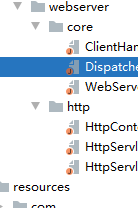

原因:项目下的src/main/java目录不是源码目录,将其设置为源码目录即可.

如图:如果右键java目录选择new后没有右侧菜单中的Java Class就说明这个java目录不是源码目录了(图标不是蓝色)

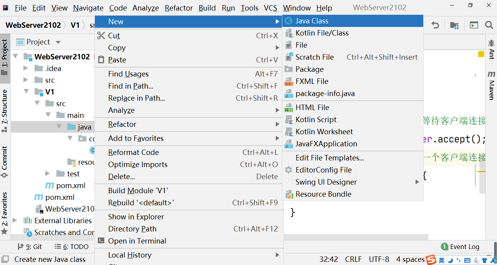

##### 步骤一:

idea菜单顺序选择file->Project Struture

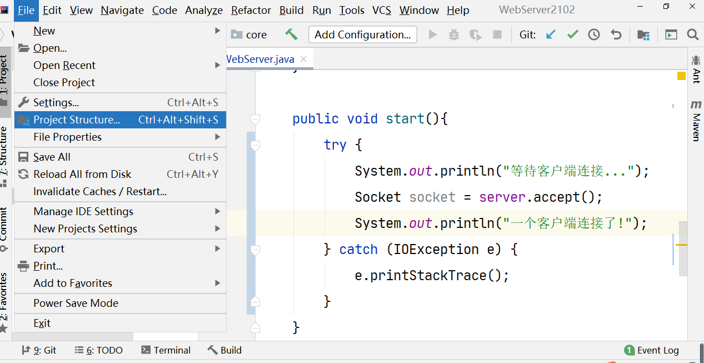

##### 步骤二:

弹出框中依次选择

1. Modules
2. 中间一栏选择不能创建类的项目(图上的是V1)
3. 右侧选择Sources,然后下面找到对应的java目录,并选择Sources(蓝色图标)的源码目录,即可. 

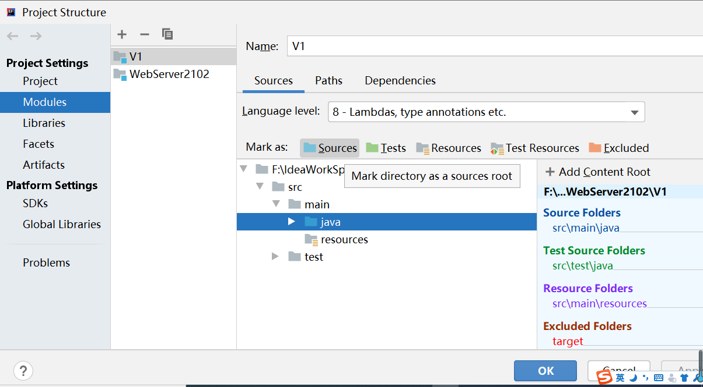

### 2:运行程序控制台显示无法加载主类

如图:

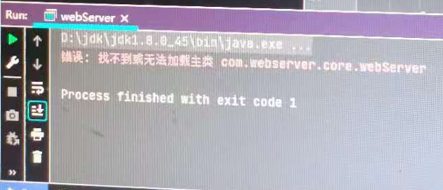

解决办法:

重构项目,通常就可以解决问题:选择菜单栏上的Build->Rebuild Project.

重构后在尝试运行.

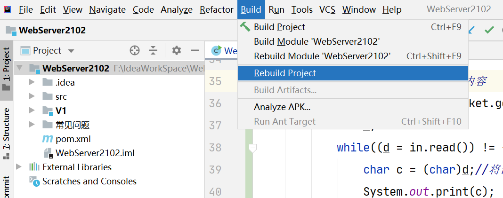

### 3:浏览器输入路径请求服务端后,服务端输出的内容是乱码

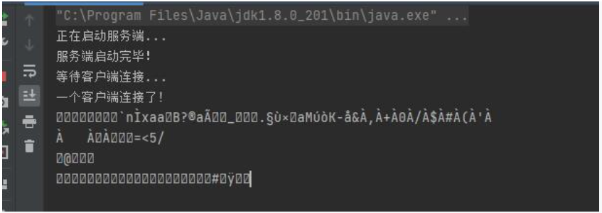

原因:浏览器地址栏中的路径协议用的是https.

解决:浏览器地址栏输入地址时,前面以http开始即可.

### 4:启动WebServer后控制台报错

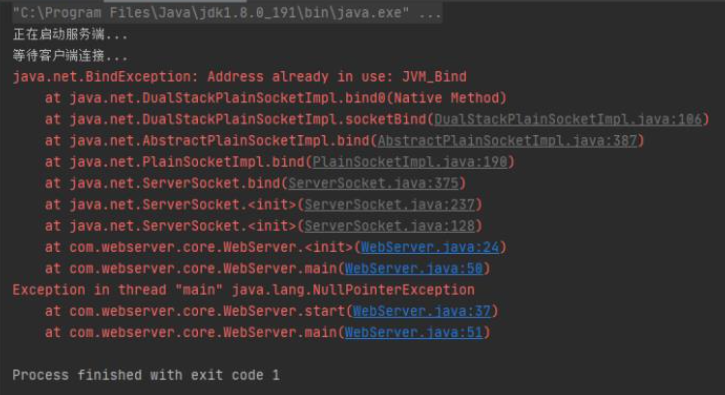

这个错误是端口被占用了.WebServer实例化时指定的端口(8088)

原因:通常是由于服务端启动了两次导致的.

解决:将之前的服务端关闭后再启动.经常是因为例如:V1的启动没有关闭,然后创建新版本V2后再启动V2的WebServer时报错.此时要先将原V1的WebServer关闭

### 5:程序启动后出现下图错误

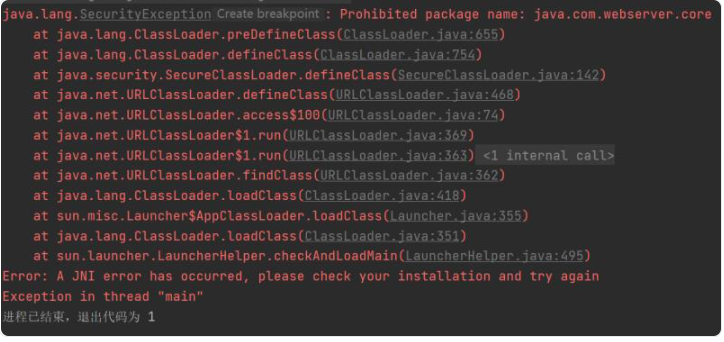

原因:复制上一个版本的java目录时，粘贴到当前版本的java目录中了.

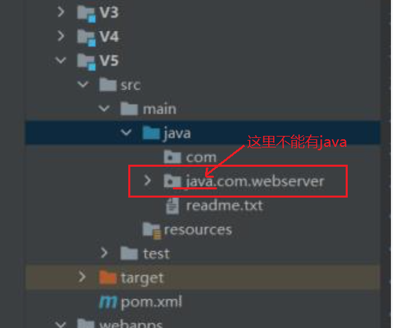

解决:将上一个版本的java目录粘贴到当前版本的main目录中覆盖java目录

### 6:浏览器请求服务端后，服务端出现下面错误

对应的报错代码为:

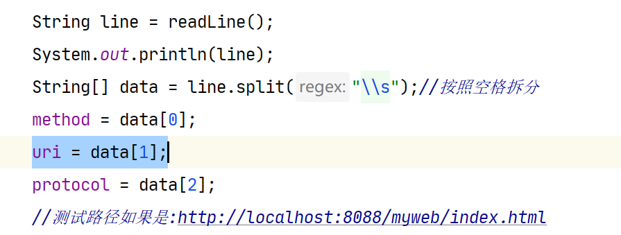

原因:由于浏览器发送了空请求

解决:不要使用浏览器上的后退和前进功能刷新页面可最大程度避免空请求的产生.或关闭浏览器重新启动并访问，或换一个浏览器访问，或等待后期版本服务端忽略空请求来解决

## 7:浏览器请求后出现下面错误

原因:

可能的原因有两种

1:HttpRequest解析请求时，没有将请求所有内容读取完毕(请求行和消息头)，要检查代码

2:发送响应时Content-Type的值与实际发送的响应正文长度不一致。检查这两部分的发送工作

## 8:浏览器输入一个路径发起请求后，服务端出现如下错误

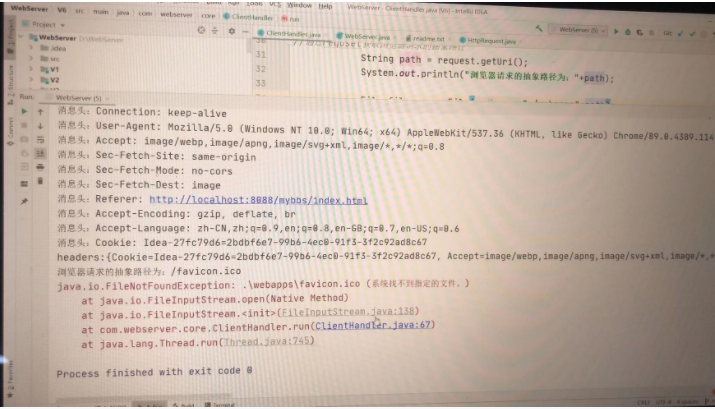

原因:系统找不到指定的文件是一个名为favicon.ico的文件。这是浏览器的自发行为，请求服务端的一个图标。

解决:要么响应404，要么准备一个.ico的图标文件并取名favicon.ico,放在webapps目录下即可。

## 9:启动WebServer时idea弹出提示框

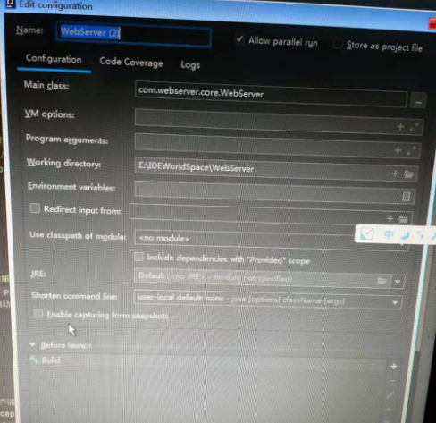

解决:将Use classpath of modules选项中选择当前项目版本即可

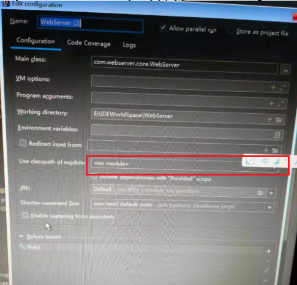

## 10:浏览器请求服务端后,出现如下错误

原因:通过request获取的抽象路径定位到了webapps目录,

​         这由于浏览器地址栏输入的:http://localhost:8088/(这里没有输入内容)

​         而目录是无法读取并响应给客户端的

解决:在ClientHandler处理请求的环节,通过抽象路径实例化File时要判断表示的不是一个目录才响应

## 11:浏览器请求服务端后,展现的内容如下

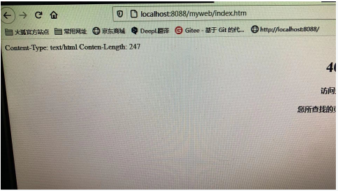

原因:发送的响应未按照HTTP协议的要求发送.

解决:检查发送响应代码,看看是否有丢失或多发了CRLF这样的操作

​        并且图上还有一个错误,Content-Length的响应头名字拼写错误,这可能还导致页面展示的是源代码

## 12:ClientHandler出现下面错误

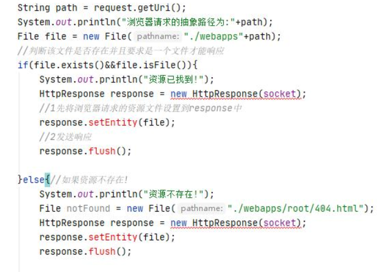

原因:

1:导包错误,导入的不是com.webserver.http包下自己定义的HttpResponse

2:HttpResponse没有提供构造方法

以上哪种要看idea提示的是哪种错误.

## 13:服务端控制台输出如下异常

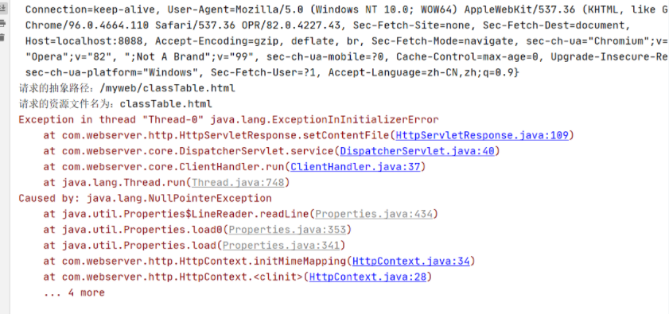

或

原因:

web.properties文件不在HttpContext.class文件所在的目录中

解决办法:

1:首先确保下图所示:

   注:resources下的com.webserver.http要手动分别创建对应的目录.

​        即:先创建com目录,然后在com目录下再创建webserver目录,最后在webserver下创建			 http目录

​        切勿直接创建一个目录,取名:com.webserver.http

2:编译一下项目:

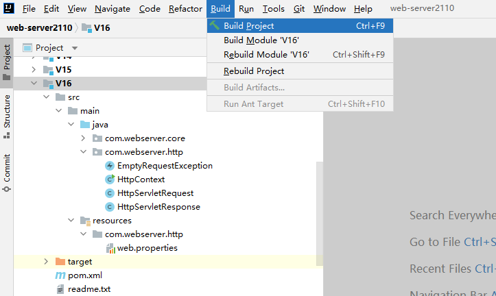

3:确保target/classes/com/webserver/http目录下有web.properties即可

若上面编译后target/classes/com/webserver/http目录下没有这个文件,可手动复制该文件到这里即可解决

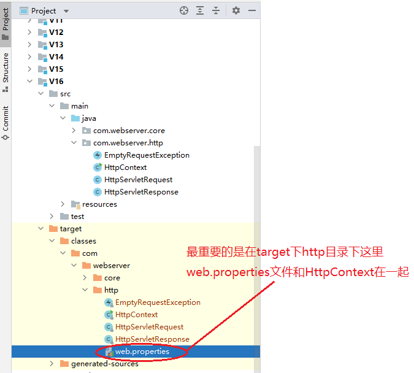

